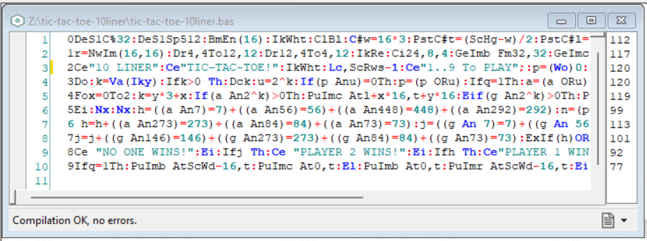

# TIC TAC TOE (10 LINER)
BASIC 10 liner "Tic-Tac-Toe" for 2 players

**TIC TAC TOE (10 LINER)** is a TIC-TAC-TOE game for two players, written in [ugBASIC](https://ugbasic.iwashere.eu) and that runs on various 8-bit home computers. This game is a paper-and-pencil game for two players who take turns marking the spaces in a three-by-three grid with X or O. The player who succeeds in placing three of their marks in a horizontal, vertical, or diagonal row is the winner. It is a solved game, with a forced draw assuming best play from both players. This game is designed for two players.

[Click here](/docs/instructions.md) to read the instructions on how to play. 

[Click here](https://spotlessmind1975.itch.io/tic-tac-toe-10liner) to download the executables for the various home computers:
  * **ATARI 400/800** [XEX format] ([more info](docs/instructions-atari.md))
  * **ATARI XL/XE** [XEX format] ([more info](docs/instructions-atarixl.md))
  * **Commodore 64** [PRG & D64 format] ([more info](docs/instructions-c64.md))
  * **TRS-80 Color Computer (COCO)** [BIN & DSK format] ([more info](docs/instructions-coco.md))
  * **AMSTRAD CPC 664** [DSK format] ([more info](docs/instructions-cpc.md))
  * **Dragon 64** [BIN format] ([more info](docs/instructions-d64.md))
  * **MSX** [ROM format]([more info](docs/instructions-msx1.md))
  * **Olivetti Prodest PC128** [K7 tape format] ([more info](docs/instructions-pc128op.md))
  
This game joined the ["BASIC10Liner" competition 2023](https://gkanold.wixsite.com/homeputerium).

Since it joined this competition, the game itself is modest in size, and the given source code respects strong constraints on the length of each line (category: **PUR-120**) and it does not rely on third party libraries. The check has been done using [UGBASIC-IDE](https://spotlessmind1975.itch.io/ugbasic-ide).

For those wishing to deepen the details of its implementation, please refer to the following documents:
 *  [the source code](/docs/source.md)
 *  [the internal state of the game](/docs/game-state.md)
