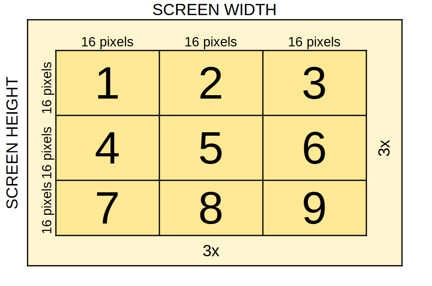
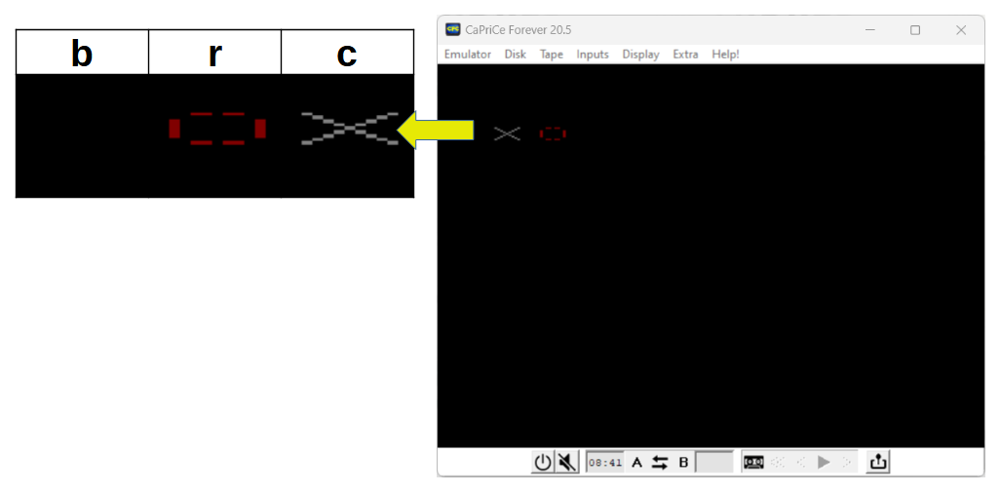
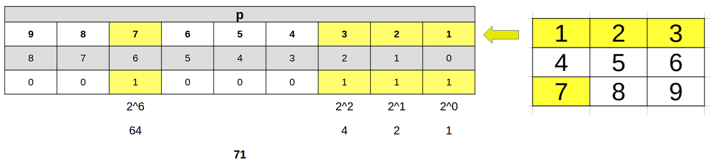
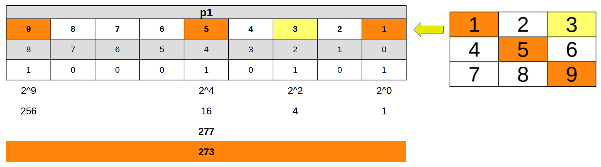

# INTERNAL GAME STATE

## THE BOARD MARGINS (t, l)

Now we calculate the left (`l`) and top margins (`t`) of the game board. This type of calculations is carried out through the use of the constants (`CONST`) which, in general, allow a better performance and an employment of space equal to zero.

Since they are parameters that depend on the geometry of the resolution selected by  [ugBasic](https://ugbasic.iwashere.eu), the `POSITIVE` modifier is used in order to avoid that for some resolutions many limited the constant becomes negative. This allows, for example, to exclude certain targets that do not have enough resolution

## THE PIECES (b, c, r)

We define three spaces of image where we will position the background to delete the symbol (`b`), the symbol **O** (`r`) and the symbol **X** (`c`), respectively. Since competition rules prevent loading files from mass storage media, the technique of drawing graphics with [ugBasic](https://ugbasic.iwashere.eu) primitives was chosen. Once drawn, the elements are captured with the `GET IMAGE` primitive and stored in the three variables above.

## THE GAME BOARD (p, p1, p2)

The variable `p` takes care of memorizing which boxes are actually occupied during the game, while `p1` and `p2` do the same for each player. 

The set of boxes is represented by a set of bits. Each bit of the various variables will indicate whether the box is empty (bit 0) or used (bit 1). As there are 9 boxes (1...9), 9 bits are needed. Since a single byte cannot hold more than 8 bits, a variable type with two bytes must be used. 

In [ugBasic](https://ugbasic.iwashere.eu) this variable is the `WORD` and therefore contains 16 bits, of which only the first nine will be used.

## WHO WINS? (w1, w2, net)

The victory conditions for each player and the drawn condition is stored in `w1`, `w2` and `net` variable, respectively. So, when all squares are occupied, no other moves are possible and the game is drawn. On the same way, when specific boxes are used, the player win.

By using the bits, we can speed up the verification of various conditions, without looping throught an array.

To decide the drawn is enought to check a single value (all 1 to 9 bits so check for value `511`) for the `p` variable. To check if any player wins, we must check all the game combinations that determine a victory:

  * all equal symbols on each line: `7`, `56`, `448`;
  * all equal symbols in each column: `49`, `92`, `124`;
  * all equal symbols on the main diagonal: `273`;
  * all equal symbols on the secondary diagonal: `84`.

Clearly, it is not the specific value that is important but that the bits are so valued. So you need to "mask" the bits to check only those bits, excluding those that are of little interest. To do this, the bit-by-bit logical AND operation must be used.

To optimize the coding space, instead of verifying each single condition with a separate `IF` or with a series of logical `OR` conditions, the convention is used whereby the comparison operation (`=`) by itself gives an algebraic result. Adding all the algebric results, even if only one is non-zero, will lead to the same result but with less code. The conditions to be checked are three, separately: the victory of the first player, the victory of the second player, the draw. So three sums are expected.

## SELECTED BOX (k)

The box where the player wants to place his symbol is collected in the variable `k`. This variable is then normalized to zero, to locate the corresponding bit in the various controls.

## CURRENT PLAYER (q)

The current player will be placed in the variable `q`.

## ROW AND COLUMN (x,y)

During the game board drawing phase, the `x` and `y` variables will contain, respectively, the column and the row to be drawn.
