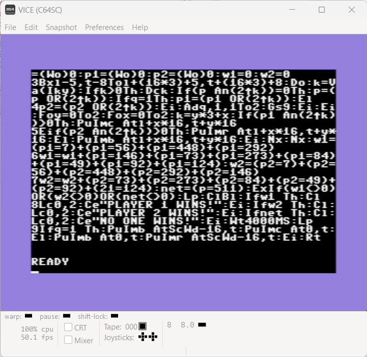
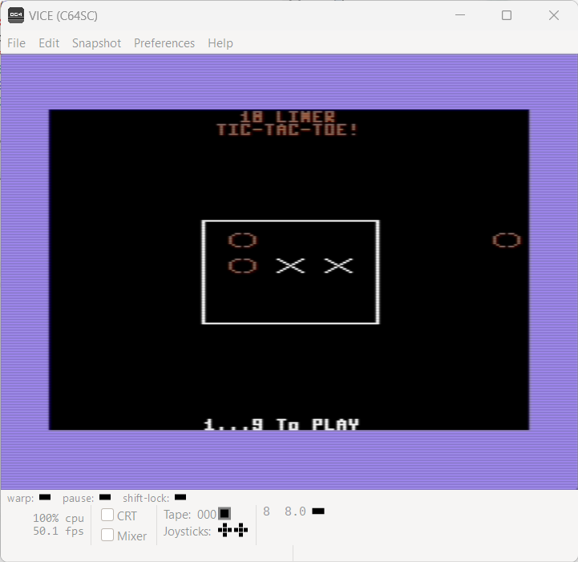

# INSTRUCTIONS

## COMMODORE 64

In order to play this game on a **COMMODORE 64**, you need this home computer or to download and install an emulator. The game has been tried on *VICE version 3.6.1* .

VICE is a program that runs on a Unix, MS-DOS, Win32, OS/2, BeOS, QNX 4.x, QNX 6.x, Amiga, Syllable or Mac OS X machine and executes programs intended for the old 8-bit computers. The current version emulates the C64, the C64DTV, the C128, the VIC20, practically all PET models, the PLUS4 and the CBM-II (aka C610/C510). An extra emulator is provided for C64 expanded with the CMD SuperCPU

The emulator can be downloaded [here](https://vice-emu.sourceforge.io/).

### Loading instructions (PRG file / D64 image)

Once the emulator software has been installed, follow the instructions below:
 - start **x64sc.exe** program;
 - click on **File** > **Smart attach...**
 - select <code>tic-tac-toe-10liner.c64.prg</code> file ([click here to download](../bin/tic-tac-toe-10liner.c64.prg)) or <code>tic-tac-toe-10liner.c64.d64</code> file ([click here to download](../bin/tic-tac-toe-10liner.c64.d64));
 - click on **Open**.

Alternatively, you can directly perform the command line game, indicating the file as a parameter of the emulator, so you can type:
 - <code>x64sc.exe tic-tac-toe-10liner.c64.prg</code>
 - <code>x64sc.exe tic-tac-toe-10liner.c64.d64</code>

### Listing the source code

To take part to the BASIC 10Liner Contest, you must be able to consult the source source. This is possible thanks to the [ugBASIC](https://ugbasic.iwashere.eu) runtime module, which allows you to show the source with the `LIST` command.

### Running the game

The game can be run by calling the command `RUN`.
