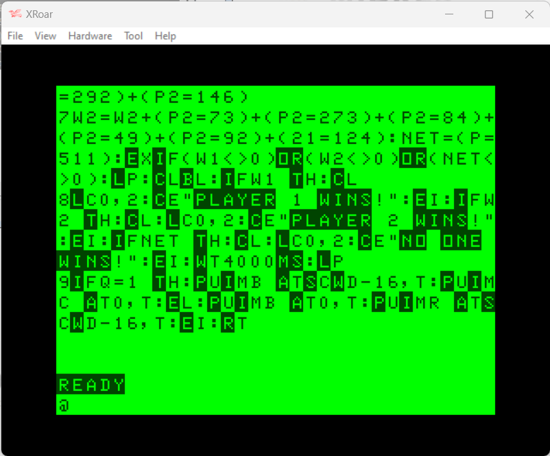
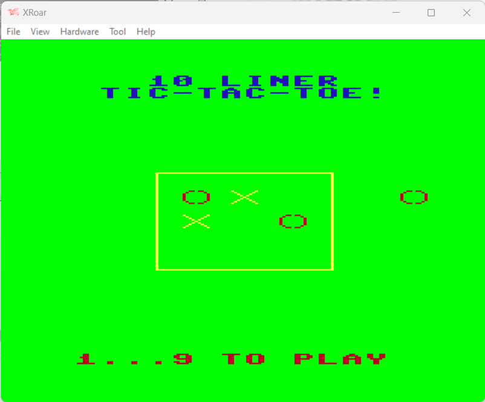

# INSTRUCTIONS

## TRS-80 COLOR COMPUTER (COCO)

In order to play this game on a **TRS-80 Color Computer**, you need this home computer or to download and install an emulator. The game has been tried on *XRoar 1.2* .

XRoar emulates the Dragon 32/64; Tandy Colour Computers 1, 2 and 3; the Tandy MC-10; and some other similar machines or clones. It runs on a wide variety of platforms.

The emulator can be downloaded [here](https://www.6809.org.uk/xroar/).

### Loading instructions (BIN file)

Once the emulator software has been installed and the TRS-80 ROMS has been installed under the "roms" folder, you can directly perform the command line game, indicating the file as a parameter of the emulator:
 - <code>xroar.exe --machine coco tic-tac-toe-10liner.coco.bin</code> ([click here to download](../bin/tic-tac-toe-10liner.coco.bin))
 
### Loading instructions (DSK image)

Once the emulator software has been installed and the TRS-80 ROMS has been installed under the "roms" folder, you can directly perform the command line game, indicating the file as a parameter of the emulator:
 - <code>xroar.exe --machine coco tic-tac-toe-10liner.coco.dsk</code>  ([click here to download](../bin/tic-tac-toe-10liner.coco.dsk))

Once loaded the disk image, the following commands must be typed to load and run the game:
 - <code>LOADM"TIC-TAC-.COC"</code>
 - <code>EXEC</code>

### Listing the source code

To take part to the BASIC 10Liner Contest, you must be able to consult the source source. This is possible thanks to the [ugBASIC](https://ugbasic.iwashere.eu) runtime module, which allows you to show the source with the `LIST` command.

### Running the game

The game can be run by calling the command `RUN`.
