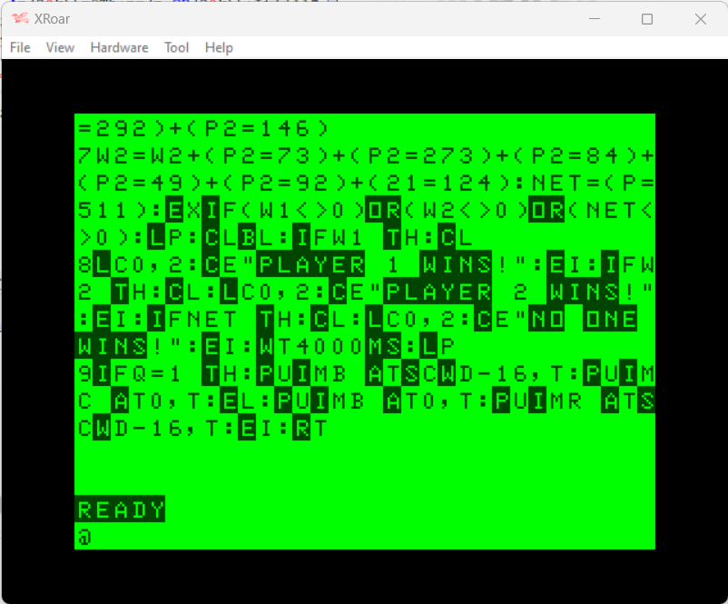
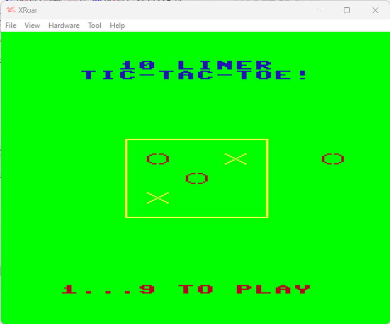

# INSTRUCTIONS

## DRAGON 64

In order to play this game on a **Dragon 64**, you need this home computer or to download and install an emulator. The game has been tried on *XRoar 1.2* .

XRoar emulates the Dragon 32/64; Tandy Colour Computers 1, 2 and 3; the Tandy MC-10; and some other similar machines or clones. It runs on a wide variety of platforms.

The emulator can be downloaded [here](https://www.6809.org.uk/xroar/).

### Loading instructions

Once the emulator software has been installed and the Dragon 64 ROMS has been installed under the "roms" folder, you can directly perform the command line game, indicating the file as a parameter of the emulator:
 - <code>xroar.exe --machine d64 tic-tac-toe-10liner.d64.bin</code> ([click here to download](../bin/tic-tac-toe-10liner.d64.bin))
 
### Listing the source code

To take part to the BASIC 10Liner Contest, you must be able to consult the source source. This is possible thanks to the [ugBASIC](https://ugbasic.iwashere.eu) runtime module, which allows you to show the source with the `LIST` command.

### Running the game

The game can be run by calling the command `RUN`.
