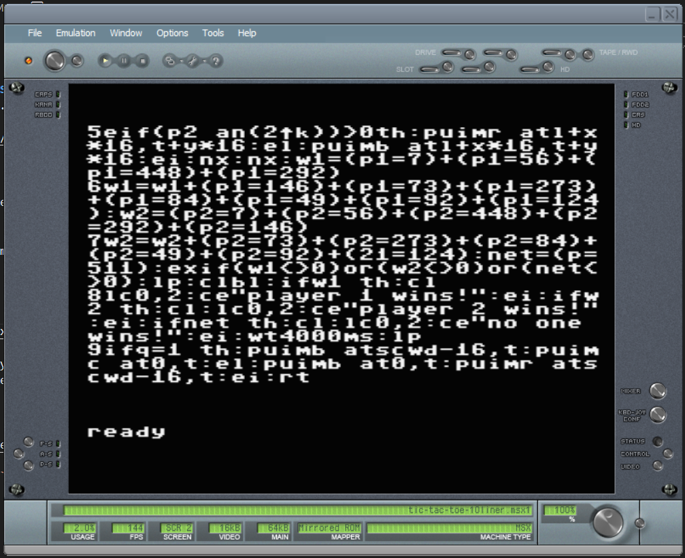
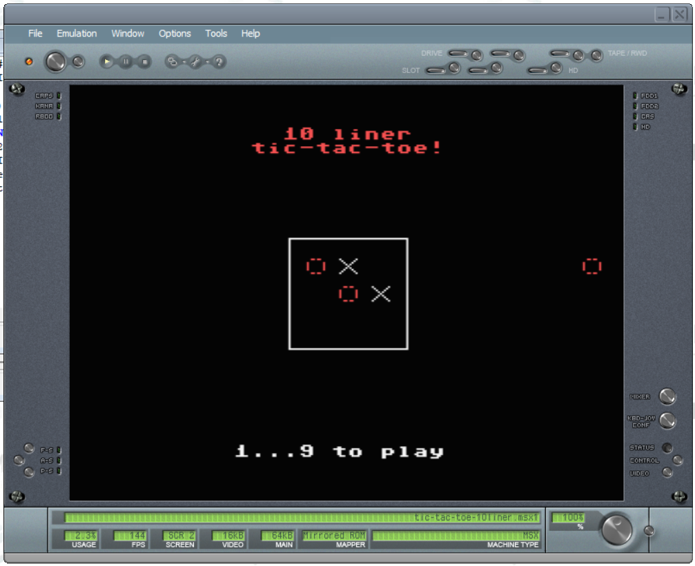

# INSTRUCTIONS

## MSX

In order to play this game on a generic **MSX** home computer, you need this home computer or to download and install an emulator. The game has been tried on *BlueMSX version 2.8.2* .

The emulator can be downloaded [here](http://bluemsx.msxblue.com/download.html).

### Loading instructions

Once the emulator software has been installed, follow the instructions below:
 - start **bluemsx.exe** program;
 - click on **Slot** > **Insert...**
 - select <code>tic-tac-toe-10liner.msx1.rom</code> file ([click here to download](../bin/tic-tac-toe-10liner.msx1.rom));
 - click on **Open**.

### Listing the source code

To take part to the BASIC 10Liner Contest, you must be able to consult the source source. This is possible thanks to the [ugBASIC](https://ugbasic.iwashere.eu) runtime module, which allows you to show the source with the `LIST` command.

### Running the game

The game can be run by calling the command `RUN`.
