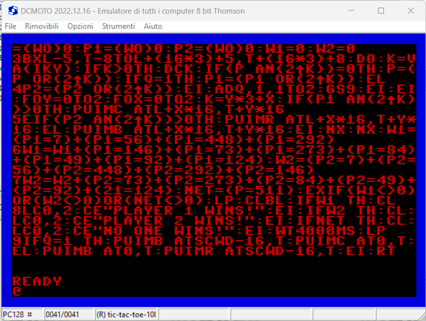
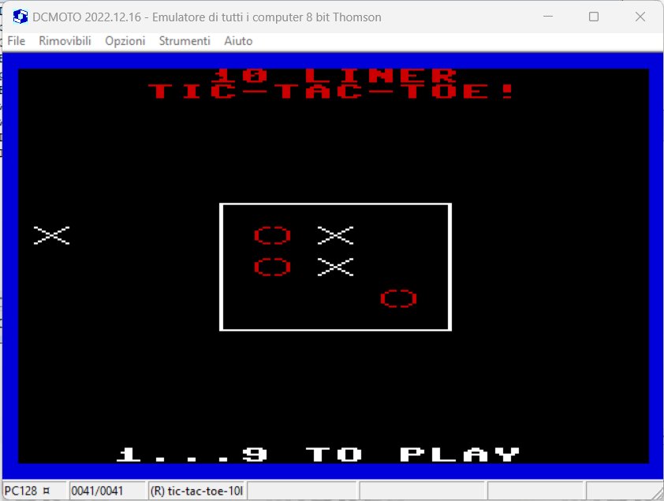

# INSTRUCTIONS

## OLIVETTI PRODEST PC128

In order to play this game on an **Olivetti Prodest PC128** you need this home computer or to download and install an emulator. The game has been tested on *DCMOTO version 2023.02.08* .

*DCMOTO** is a Thomson 8 bit computer emulator for Windows. It emulates the Thomson MO5, MO6, T9000, TO7, TO8, TO9, and the Olivetti Prodest PC128 series of computers. 

The emulator can be downloaded [here](http://dcmoto.free.fr/emulateur/index.html).

### Loading instructions

Once the emulator software has been installed, follow the instructions below:
 - start **dcmoto.exe** program;
 - click on **Options**;
 - select **PC128 Olivetti**;
 - click on **Ok**;
 - click on **Removables**;
 - click on **Load...** next to "K7" drawer;
 - select <code>tic-tac-toe-10liner.pc128op.k7</code> file ([click here to download](https://spotlessmind1975.itch.io/tic-tac-toe-10liner));
 - click on **Open**;
 - type <code>CLEAR,&H2FFF: LOADM"CASS:",R: EXEC</code>.

### Listing the source code

To take part to the BASIC 10Liner Contest, you must be able to consult the source source. This is possible thanks to the [ugBASIC](https://ugbasic.iwashere.eu) runtime module, which allows you to show the source with the `LIST` command.

### Running the game

The game can be run by calling the command `RUN`.
