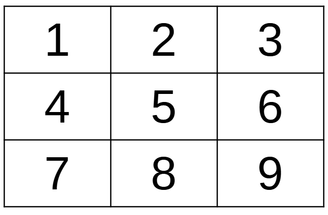

# INSTRUCTIONS

## How to play

In order to play this game you need an original's 8-bit home computer or an emulator, because the game does not work on modern computers. The game has been tried and it works correctly with following computers and emulators:

  * **ATARI 400/800** ([more info](instructions-atari.md))
  * **ATARI XL/XE** ([more info](instructions-atarixl.md))
  * **Commodore 64** ([more info](instructions-c64.md))
  * **TRS-80 Color Computer (COCO)** ([more info](instructions-coco.md))
  * **AMSTRAD CPC 664** ([more info](instructions-cpc.md))
  * **Dragon 64** ([more info](instructions-d64.md))
  * **MSX** ([more info](instructions-msx1.md))
  * **Olivetti Prodest PC128** ([more info](instructions-pc128op.md))

Once loaded, you can run the game by typing `RUN`.

## Game board

This Tic-tac-toe is played on a three-by-three grid by two players, who alternately place the marks **X** and **O** in one of the nine spaces in the grid. By pressing the digit from `1` to `9`, each player will put the sign on the game board. 

The game ends what you have three signs of the same type on a vertical line, one horizontal or a diagonal. If this does not happen, you have equality, and nobody wins.

There is no universally-agreed rule as to who plays first, but in this game the convention that **O** plays first is used.

